# MIA2 Tutorial

This tutorial describes the updated MIA2 workflow for preparing a shared channel
space, calculating Morlet time-frequency representations, converting Brainstorm
data to MIA ROI data, visualizing averages, and contrasting two conditions.

## 1. Concatenate channels

**Process:** `MIA/bst_plugin/process_concatenate_channels.m`

This process creates a new grand subject containing the channels from the
selected subjects in the current Brainstorm protocol. The shared channel space
makes later ROI-based MIA analyses easier to run.

In Brainstorm, open:

`Run → Add process icon → Standardize → MIA: Concatenate Channels`

<p>
  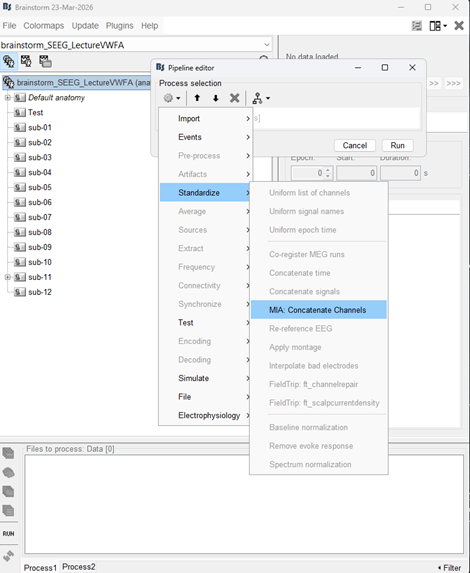
  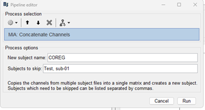
</p>

The process has two user-facing inputs:

1. **New subject name:** Name of the grand subject to create. The default is `COREG`.
2. **Subjects to skip:** Comma-separated subjects that should not be included.
   Leave this field empty to include all subjects.

For example:

```text
Subject01, Subject02
```

Click **Run** to create the grand subject.

## 2. Calculate time-frequency representations with Morlet wavelets

**Process:** `MIA/bst_plugin/process_mia_extract_tf.m`

This process calculates a Morlet-wavelet time-frequency representation of the
Brainstorm data dropped into **Process1**. It uses the current Brainstorm
protocol and applies 1/f normalization.

In Brainstorm, open:

`Frequency → MIA: Time-frequency (Morlet by band + 1/f norm)`

<p>
  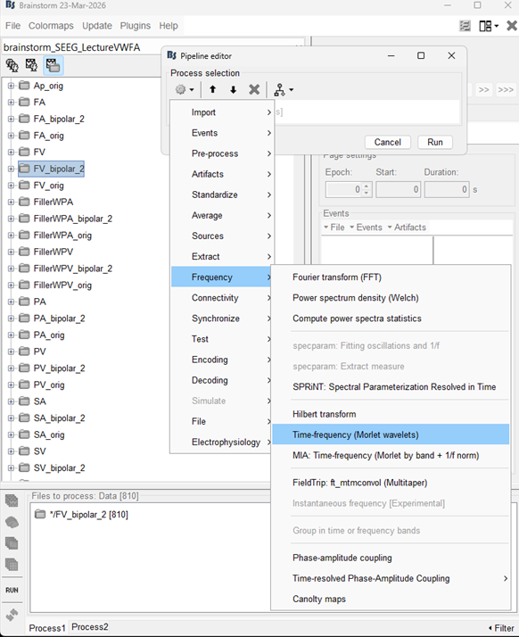
  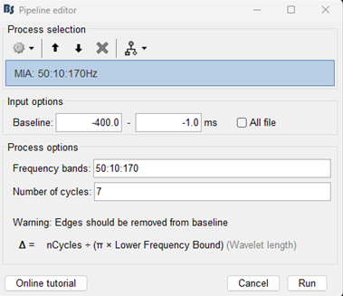
</p>

The process contains these inputs:

1. **Baseline:** Time window in milliseconds used for 1/f normalization. Enter a
   start and end time, such as `-400.0` to `-1.0` ms, or select **All file** to
   use the entire file.
2. **Frequency bands:** Frequencies and steps to extract, written as a MATLAB
   array expression. For example, `50:10:170` extracts frequencies from 50 Hz
   through 170 Hz in 10 Hz steps.
3. **Number of cycles:** Number of cycles at the Morlet wavelet's central
   frequency. For example, `7` controls the time-frequency resolution trade-off.

Click **Run** to calculate the time-frequency representation.

## 3. Convert Brainstorm data to MIA

**Process:** `MIA/bst_plugin/process_mia_bst2mia.m`

This process converts Brainstorm data into MIA ROI data. It uses the current
Brainstorm protocol, the condition dropped into **Process1**, the selected
subject's channel file, and a labeling table.

In Brainstorm, open:

`Run → Add process icon → Test → MIA: Convert from BST to MIA`

<p>
  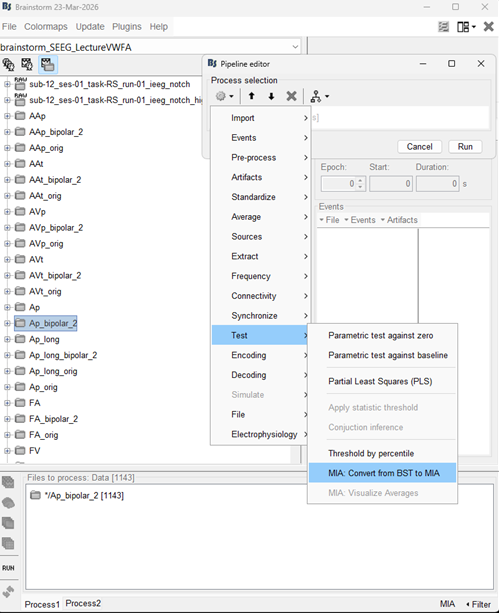
  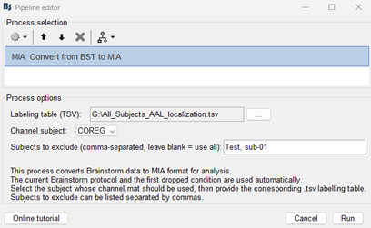
</p>

The conversion uses these inputs:

1. **Files in Process1:** Drop one condition from the Brainstorm database. The
   process reads the condition automatically from `sInputs(1).Condition`.
2. **Labeling table (TSV):** Path to the `.tsv` file containing the labeling information.
3. **Channel subject:** Subject from the current Brainstorm protocol whose
   `channel.mat` file should be resolved automatically.
4. **Subjects to skip:** Comma-separated subjects to exclude. Leave the field
   empty to use all eligible subjects.

For example:

```text
Subject01, Subject02
```

Click **Run**. For each converted condition, the process creates:

```text
<brainstorm_protocol_dir>/data/<group_subject>/ROIS/<ConditionName>_rois.mat
```

`<ConditionName>` is the condition dropped into Process1. With the default
grand-subject name, `<group_subject>` is `COREG`.

## 4. Visualize averages

**Process:** `MIA/bst_plugin/process_mia_group_gui.m`

This process opens `mia_group_gui` from ROI files already saved in the current
Brainstorm protocol.

In Brainstorm, open:

`Run → Add process icon → Test → MIA: Visualize Averages`

<p>
  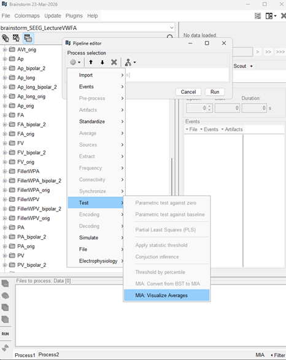
  
  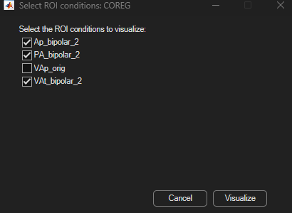
</p>

The process has one user-facing input:

1. **ROI subject:** Subject from the current Brainstorm protocol whose ROI files
   should be read from `data/<SelectedSubject>/ROIS`.

After you click **Run**, the process:

1. Reads the current protocol with `bst_get('ProtocolInfo')`.
2. Reads the selected ROI subject.
3. Scans `data/<SelectedSubject>/ROIS`.
4. Finds and sorts all files matching `*_rois.mat`.
5. Removes `_rois.mat` from each filename to create the displayed condition name.
6. Opens a checkbox dialog for selecting one or more conditions.
7. Loads the `rois` variable from each selected file.
8. Calls `mia_group_gui(...)` with the selected ROI structures.

For example:

```text
Ap_bipolar_2_rois.mat → Ap_bipolar_2
```

### Individual-condition visualization

The interface opens one tab for each selected condition. Each row is an ROI.
The columns report the number of patients (`NPt`), number of contacts (`Nc`),
correlation across patients (`R_p`), and correlation across contacts (`R_c`).

Select one or more ROI rows and then:

- Use **ROI panel** to open the detailed ROI view.
- Use **ROIs Gd Ave** to display average ROI activity.
- Use **Close figs** to close figures opened from this window.

<p>
  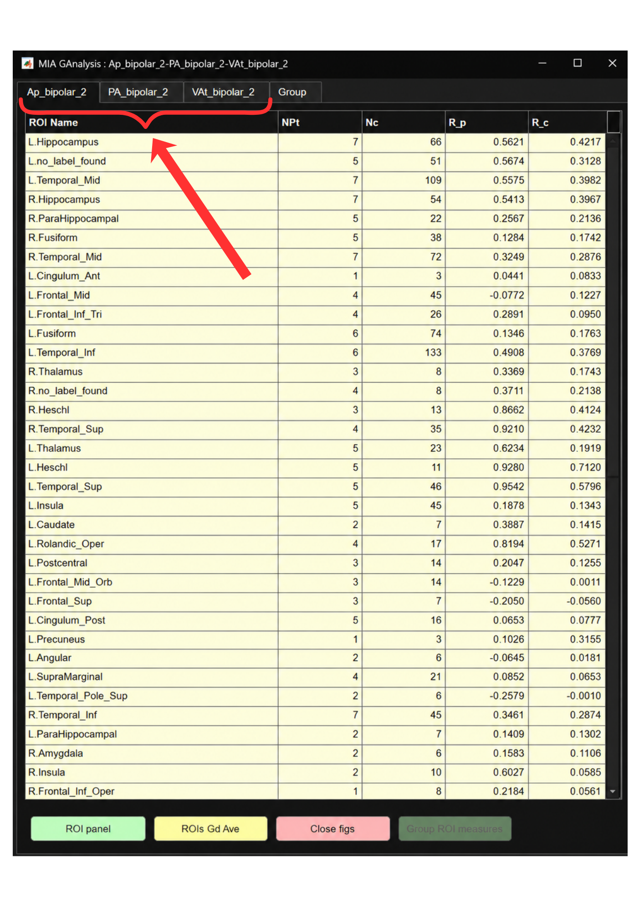
  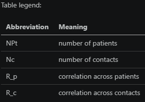
</p>

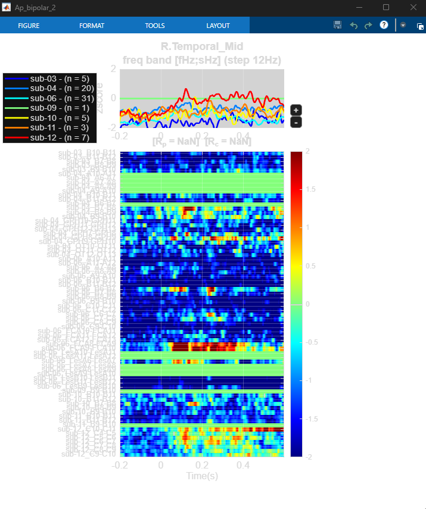

### Group-comparison visualization

When multiple conditions are selected, the interface adds a **Group** tab. It
compares the selected conditions using ROIs present across conditions. Select an
ROI and click **Group ROI Timeseries** to plot the conditions together.

<p>
  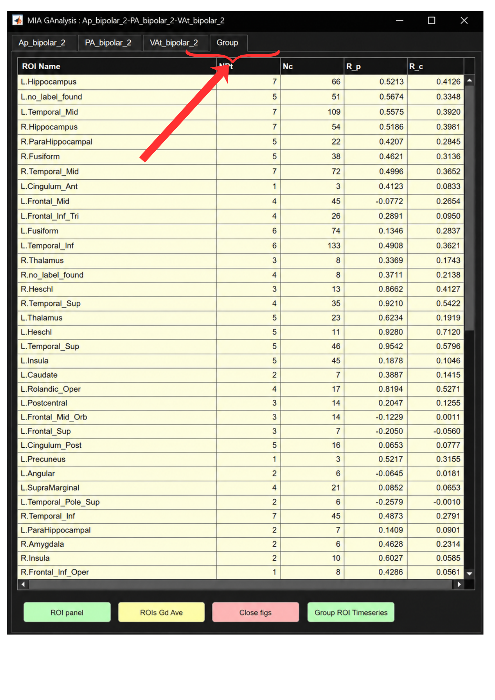
  
</p>

The generated line plots show z-scored activity over time. The heatmap
summarizes activity across contacts or subjects, and its color bar indicates
z-score values.


### Final visualization call

When one condition is selected, the process calls:

```matlab
mia_group_gui(selectedRois{1}, selectedConditionNames{1});
```

Equivalent example:

```matlab
Ap_bipolar_2_file = load('data/COREG/ROIS/Ap_bipolar_2_rois.mat', 'rois');
mia_group_gui(Ap_bipolar_2_file.rois, 'Ap_bipolar_2');
```

When multiple conditions are selected, the process calls:

```matlab
mia_group_gui(selectedRois{:}, strjoin(selectedConditionNames, '-'));
```

Equivalent example:

```matlab
cond_1_file = load('data/COREG/ROIS/cond_1_rois.mat', 'rois');
cond_2_file = load('data/COREG/ROIS/cond_2_rois.mat', 'rois');
mia_group_gui(cond_1_file.rois, cond_2_file.rois, 'cond_1-cond_2');
```

The process uses three helper functions:

- `get_protocol_subject_options()` populates the ROI-subject list from the current protocol.
- `get_subject_roi_files(roiDir)` finds, sorts, and names available `*_rois.mat` files.
- `select_roi_conditions(conditionNames, subjectName)` opens the condition-selection dialog.

## 5. Run statistics

This process calculates a statistical contrast between two conditions.

1. Drag and drop exactly two processed conditions into the process pipeline.
2. Select the contrast process as shown below.
3. Run the process to load both conditions, calculate the contrast, and create
   statistical results for visualization and further analysis.

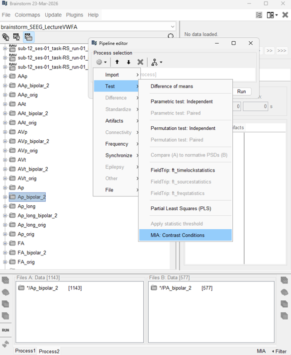

The output includes statistical measures such as p-values and effect sizes.
